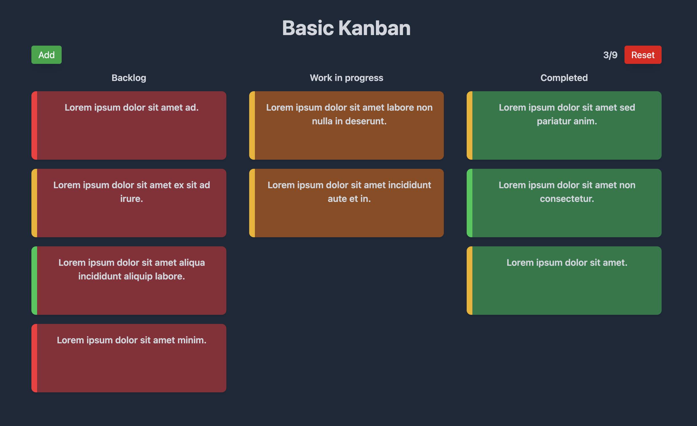
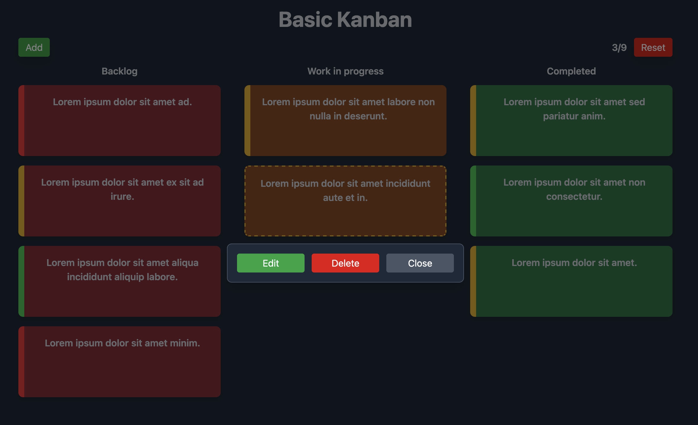
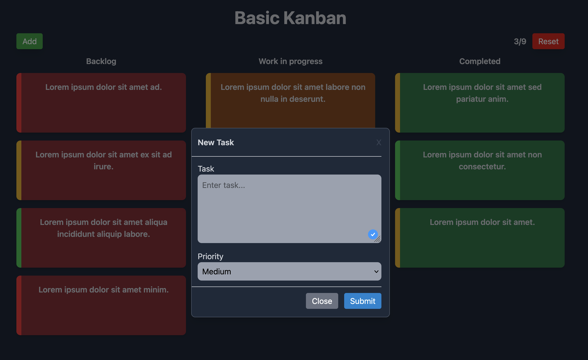
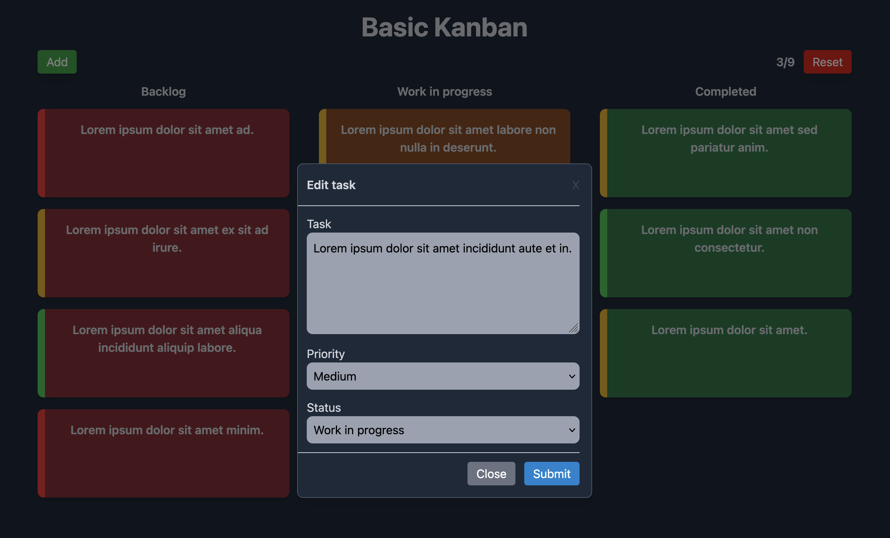

# Basic Kanban

A simple Kanban board application built with React.  
Users can create, edit, update, and delete tasks. Each task can be moved between the three status columns — **Backlog**, **Work in Progress**, and **Completed** — providing a lightweight way to manage work items.

---

## Features

- **Add tasks** to the backlog
- **Edit tasks** (update description, priority, or status)
- **Move tasks** between columns by updating their status
- **Delete tasks** when no longer needed
- **Reset all tasks** to rest the board

---

## Prerequisites

- [Node.js](https://nodejs.org/) (v16 or later recommended)
- npm or yarn package manager

---

## Installation & Running Locally

1. **Clone the repository**
2. **cd basic-kanban**
3. **Install dependencies**

```bash
npm i
```

4. **_Start the development server_**

```bash
npm run dev
```

---

### Preview








